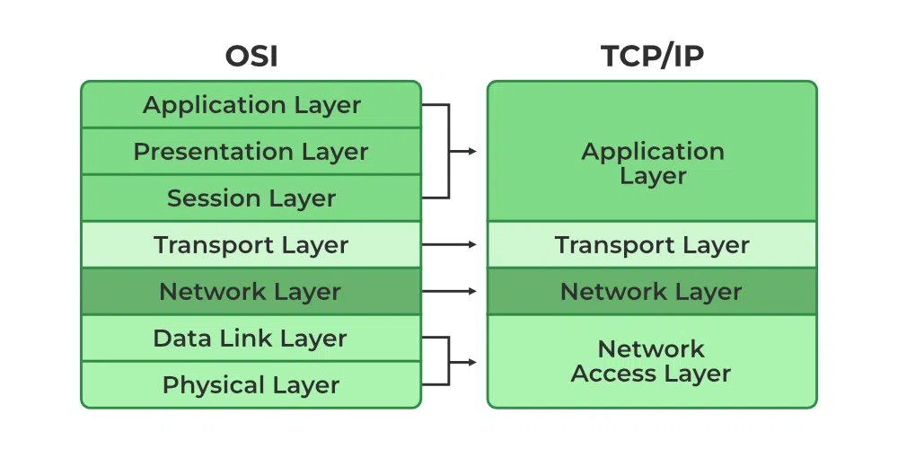

+++
date = '2025-06-24'
draft = true
title = 'Understanding the OSI model and TCP/IP network layers'
+++

The OSI model and TCP/IP underlie everything we do on the web, from visiting a site and watching a video to liking tweets or having your printer receive a document.

<!--more-->

## Introduction

First, we need to briefly understand what these two concepts are, as they are not the same. The OSI model is a standard that outlines how networking should occur. It consists of seven layers, which define the rules and methods for how a frame transforms into a packet and how a packet becomes information that your computer can understand. In contrast, the TCP/IP model takes a more focused approach, consisting of generally four to five layers derived from the OSI model.

As you can see, they are quite similar, with TCP incorporating OSI features. In the following sections, I will discuss all the layers, focusing more on those that are particularly useful for web applications in general.
